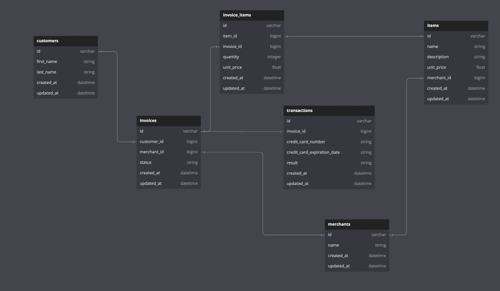

## About 
A RESTful Ruby on Rails API which exposes mock ecommerce data from a PostgeSQL database. My first time builing an API. Solo project completed over a 5-day timeline.

This API also has a front-end application that consumes it, located [here](https://github.com/stephenfabian/rails_engine_fe)

## Learning Goals
- Practice exposing an API
- Format JSON responses using serializers
- Ensure compliance with JSON:API specifications
- Use RSpec to test API endpoints
- Utilize ActiveRecord to manage data

## Built With


## Gems


## Set Up
- Clone this repo
- `bundle install`
- `rails db:{create,migrate,seed}`
- `rails db:schema:dump`

Visit the [front-end application](https://github.com/stephenfabian/rails_engine_fe) to begin front-end setup.

## Database Structure



## Deployment
- `rails s`

## Testing Instructions

- Clone this repo
- in terminal (apple or integrated)
    * `bundle install`
    * `bundle exec rspec`

## End Points

#### Merchants

```
get http://localhost:3000/api/v1/merchants
```

```
{
    "data": [
        {
            "id": "1",
            "type": "merchant",
            "attributes": {
                "name": "Schroeder-Jerde"
            }
        },
        {
            "id": "2",
            "type": "merchant",
            "attributes": {
                "name": "Klein, Rempel and Jones"
            }
        },
        {
            "id": "3",
            "type": "merchant",
            "attributes": {
                "name": "Willms and Sons"
            }
        },
     [
 }
```
```
http://localhost:3000/api/v1/merchants/42
```
```
{
    "data": {
        "id": "42",
        "type": "merchant",
        "attributes": {
            "name": "Glover Inc"
        }
    }
}
```
```
http://localhost:3000/api/v1/merchants/42/items
```
```
{
    "data": [
        {
            "id": "2425",
            "type": "item",
            "attributes": {
                "name": "Item Excepturi Rem",
                "description": "Perferendis reprehenderit fugiat sit eos. Corporis ipsum ut. Natus molestiae quia rerum fugit quis. A cumque doloremque magni.",
                "unit_price": 476.82,
                "merchant_id": 99
            }
        },
        {
            "id": "2427",
            "type": "item",
            "attributes": {
                "name": "Item Illum Minus",
                "description": "Aut voluptatem aut officiis minima cum at. Est ea sed est quia repudiandae. Eum omnis rerum in adipisci aut. Deleniti sunt voluptatibus rerum aut quo omnis.",
                "unit_price": 98.07,
                "merchant_id": 99
            }
        },
        {
            "id": "2426",
            "type": "item",
            "attributes": {
                "name": "Item Repellendus Cum",
                "description": "Odio vitae asperiores sint ut labore. Tenetur perspiciatis facere quos cum. Optio modi consequatur.",
                "unit_price": 612.11,
                "merchant_id": 99
            }
        },
    ]
}
```
#### Merchant Params
```
http://localhost:3000/api/v1/merchants/find?name=iLl
```
```
{
    "data": {
        "id": "28",
        "type": "merchant",
        "attributes": {
            "name": "Schiller, Barrows and Parker"
        }
    }
}
```
```
http://localhost:3000/api/v1/merchants/find_all?name=ILL
```
```
{
    "data": [
        {
            "id": "28",
            "type": "merchant",
            "attributes": {
                "name": "Schiller, Barrows and Parker"
            }
        },
        {
            "id": "13",
            "type": "merchant",
            "attributes": {
                "name": "Tillman Group"
            }
        },
        {
            "id": "5",
            "type": "merchant",
            "attributes": {
                "name": "Williamson Group"
            }
        },
    ]
}
```
#### Items
```
http://localhost:3000/api/v1/items
```
```
{
    "data": [
        {
            "id": "4",
            "type": "item",
            "attributes": {
                "name": "Item Nemo Facere",
                "description": "Sunt eum id eius magni consequuntur delectus veritatis. Quisquam laborum illo ut ab. Ducimus in est id voluptas autem.",
                "unit_price": 42.91,
                "merchant_id": 1
            }
        },
        {
            "id": "5",
            "type": "item",
            "attributes": {
                "name": "Item Expedita Aliquam",
                "description": "Voluptate aut labore qui illum tempore eius. Corrupti cum et rerum. Enim illum labore voluptatem dicta consequatur. Consequatur sunt consequuntur ut officiis.",
                "unit_price": 687.23,
                "merchant_id": 1
            }
        },
        {
            "id": "6",
            "type": "item",
            "attributes": {
                "name": "Item Provident At",
                "description": "Numquam officiis reprehenderit eum ratione neque tenetur. Officia aut repudiandae eum at ipsum doloribus. Iure minus itaque similique. Ratione dicta alias asperiores minima ducimus nesciunt at.",
                "unit_price": 159.25,
                "merchant_id": 1
            }
        },
    ]
}
```
```
http://localhost:3000/api/v1/items/179/merchant
```
```
{
  "data": {
    "id": "9",
    "type": "merchant",
    "attributes": {
      "name": "Hand-Spencer"
    }
  }
}
```
#### Item Creation
```
post http://localhost:3000/api/v1/items
```
```
{
    "name": "Dominic",
    "description": "Is a cool guy",
    "unit_price": 99.99,
    "merchant_id": 1 (Must be valid)
}
```
#### Item Update
```
put http://localhost:3000/api/v1/items
```
```
{
    "name": "Dominic",
    "description": "Is a cool guy",
    "unit_price": 99.99,
    "merchant_id": 1 (Must be valid)
}
```

#### Items Params
```
http://localhost:3000/api/v1/items/find_all?name=hArU
```
```
{
    "data": [
        {
            "id": "1209",
            "type": "item",
            "attributes": {
                "name": "Item At Harum",
                "description": "Fuga et aut libero veniam tenetur. Ex eligendi modi libero aut numquam at. Velit dolores non ut cupiditate aut consequatur. Maiores quas vel qui aut et voluptatum. Qui consequatur illo.",
                "unit_price": 841.97,
                "merchant_id": 55
            }
        },
        {
            "id": "1344",
            "type": "item",
            "attributes": {
                "name": "Item Aut Harum",
                "description": "Illum ducimus officia possimus est. Rerum sed quia omnis necessitatibus. A sed cupiditate blanditiis ut minus sed.",
                "unit_price": 513.97,
                "merchant_id": 59
            }
        },
        {
            "id": "682",
            "type": "item",
            "attributes": {
                "name": "Item Cum Harum",
                "description": "Libero est magnam dolores officiis velit. Porro ut laboriosam inventore consequatur ratione quae. Aut natus voluptatem saepe excepturi harum dolores.",
                "unit_price": 59.44,
                "merchant_id": 33
            }
        },
    ]
}
```
```
http://localhost:3000/api/v1/items/find_all?min_price=999
```
*You can also do ?max_price={number} or chain them with ?min_price={number}&max_price={number}*
```
{
    "data": [
        {
            "id": "1708",
            "type": "item",
            "attributes": {
                "name": "Item Eos Similique",
                "description": "Minima ex voluptatem provident voluptatem sapiente reiciendis adipisci. Eius nihil neque. Architecto omnis sunt voluptatem ratione dignissimos fuga. Sint tenetur maiores sapiente eos placeat. Sit sed perspiciatis.",
                "unit_price": 999.94,
                "merchant_id": 69
            }
        },
        {
            "id": "1063",
            "type": "item",
            "attributes": {
                "name": "Item Et Dolorem",
                "description": "Quo aut architecto eum suscipit. Cumque blanditiis aut beatae recusandae. Dolores ut accusantium deleniti.",
                "unit_price": 999.54,
                "merchant_id": 47
            }
        },
        {
            "id": "1711",
            "type": "item",
            "attributes": {
                "name": "Item Quaerat Expedita",
                "description": "Sed consequatur in atque odit ex quae perspiciatis. Ut aut quos. Reiciendis rem excepturi ex explicabo dolore. Aliquam deserunt sed voluptas.",
                "unit_price": 999.88,
                "merchant_id": 70
            }
        }
    ]
}
```
```
http://localhost:3000/api/v1/items/find?name=hArU
```
```
{
    "data": {
        "id": "1209",
        "type": "item",
        "attributes": {
            "name": "Item At Harum",
            "description": "Fuga et aut libero veniam tenetur. Ex eligendi modi libero aut numquam at. Velit dolores non ut cupiditate aut consequatur. Maiores quas vel qui aut et voluptatum. Qui consequatur illo.",
            "unit_price": 841.97,
            "merchant_id": 55
        }
    }
}
```
```
http://localhost:3000/api/v1/items/find?min_price=50
```
*You can also do ?max_price={number} or chain them with ?min_price={number}&max_price={number}*
```
{
    "data": {
        "id": "2352",
        "type": "item",
        "attributes": {
            "name": "Item A Error",
            "description": "Exercitationem rerum porro illo quam molestiae fugiat. Est sit consequatur magnam qui. Officia fugit corporis aliquam enim consectetur.",
            "unit_price": 285.96,
            "merchant_id": 97
        }
    }
}
```